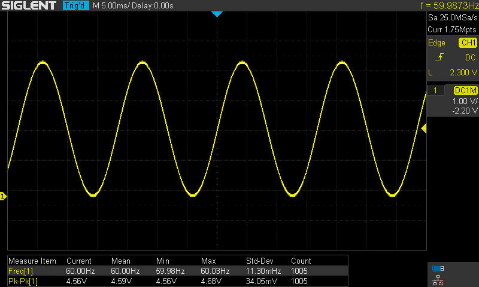
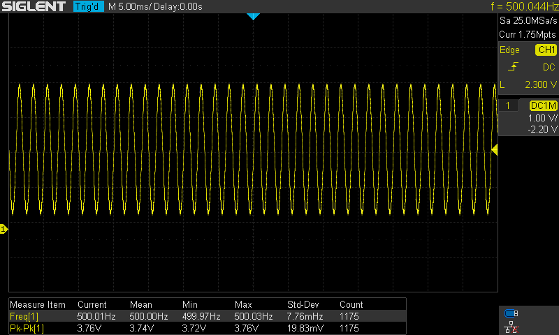

# 8-bit Direct Digital Synthesis

Table of Contents
- [Project Overview](#project-overview)
- [Getting Started](#getting-started)
- [Project Structure](#project-structure)
- [Configuration](#configuration)
- [Usage](#usage)
- [Customization](#customization)
- [Resources](#resources)
- [Contributing](#contributing)
- [License](#license)

---

## Theory

Provide a brief overview of the project, explaining its purpose and functionality.

## Circuit

Explain the necessary steps to get started with the project. Include any dependencies or tools required for development.

## Operation

Describe the structure of the project directory and highlight the key files and folders. 

## Conclusion

With an extremely low part count (one MCU and four passive components), this solution is suitable for ad-hoc waveform generation.

60 Hz Sine Wave

500 Hz Sine Wave

## Usage

Explain how to use the project template effectively. Provide guidelines, best practices, and any conventions to follow.

---
