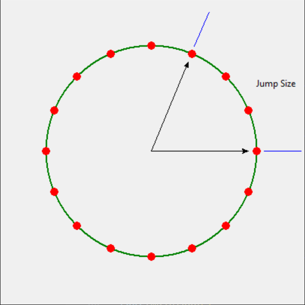

# Direct Digital Synthesis

Table of Contents
- [Theory](#theory)
- [Circuit](#circuit)
- [Operation](#operation)
- [Conclusion](#conclusion)

---

## Theory

Direct Digital Synthesis (DDS) is a method used to generate accurate analog waveforms from digital data. It works by converting digital phase information into continuous analog signals. This process involves selecting digital phase values from an accumulator in a sequential manner, and these values are then transformed into analog voltages through a digital-to-analog converter (DAC). DDS is highly valued for its flexibility and precision in generating different frequencies, making it an essential technology in a wide range of electronic applications.

The fundamental theory behind DDS revolves around its capacity to create analog waveforms by digitally controlling phase information. A reference clock signal determines the size of phase increments, and by adjusting the rate at which the phase accumulator increments, DDS can produce various frequencies. The key advantage of DDS lies in its ability to rapidly change frequencies, exhibit low phase noise, and enable precise frequency and phase adjustments, making it an indispensable tool in many electronic systems.

In its simplest form, a direct digital synthesizer can be implemented from a phase accumulator, a D/A converter, and a reference clock.

### Phase Accumulator

The phase accumulator is driven by the clock and steps through the phase cycle. Its output represents the phase information of the waveform being generated. 

### D/A Converter

Phase information from phase accumulator is converted to analog voltage by D/A converter. 

###  Reference Clock

The clock provides timing reference.

## Circuit

In this Atmega328P based implementation, the reference clock is derived from the interal clock of the MCU. The D/A converter consists of only a second order low pass filter with a cut-off frequency of ~795 Hz.

## Operation

Timer 0 is configured to phase correct PWM mode. In this mode, counter repeatedly counts from 0 to 255 and back to 0. When counter value TCNT0 matches value stored in register OCR0A, pin OC0A is toggled. Thus registers OCR0A controls the duty cycle of PWM waveform. After filtering, a voltage level is produced on Output. This value is determined by the duty cycle. Since OCR0A is an 8 bit register, the produce voltage also has an 8 bit resolution.

An interrupt is generated when the counter reaches zero. Since the nature of counter's dual slope operation, this interrupt is generated every (256+255=511) counts. This effectively produces a sampling frequency of 16Mhz/511=31311.15 Hz. Inside the interrupt service routine, the phase accumulator is incremented. The size of increment is determined by the desired frequency of waveform being generated.

The phase accumulator is implemented with a 32 bit word. Whenever the phase accumulator is incremented, it is right shifted by 22 bits, only the upper 10 bits are used to retrieve waveform's amplitude from a 1024-element lookup table. The amplitude is stored as 8-bit integer in program space.

$f_{waveform}$

## Conclusion

With an extremely low part count (one MCU and four passive components), this solution is suitable for ad-hoc waveform generation.

60 Hz Sine Wave

500 Hz Sine Wave

---